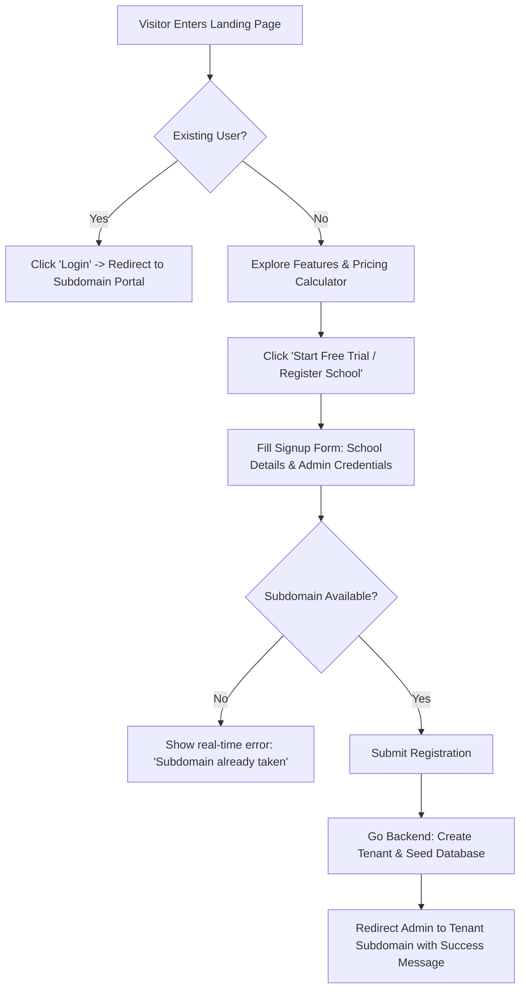
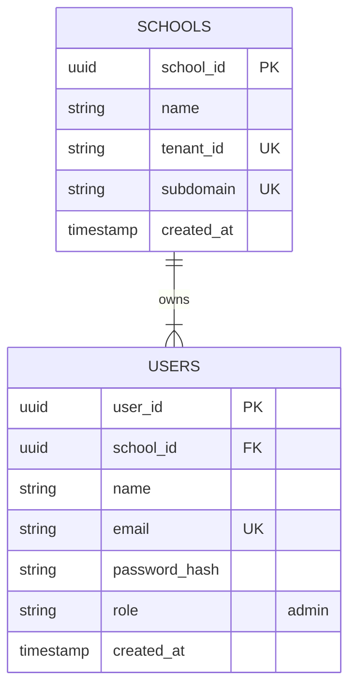

# User Story: Eduplexo Landing Page (`landing-app`)

## 1. Goal
Provide a premium, high-converting, and responsive landing page that introduces Eduplexo (SaaS School Management) to prospective school owners, principals, and admins. It must explain key benefits, showcase core features (ERP portals, Go API high-performance, and AI chatbot tutoring), and allow new tenants to register seamlessly.

---

## 2. Actors
* **Prospective Tenant (School Owner/Principal/Admin)**: A visitor looking for a school management platform who wants to sign up for a demo or buy a subscription.
* **General Visitor (Teacher, Parent, Student, Curious Browser)**: A visitor looking to understand what Eduplexo is and potentially log into their existing school portals.

---

## 3. User Stories & Acceptance Criteria

### Story 1: Discovering Eduplexo Features & Ecosystem
**As a** Prospective Tenant  
**I want to** explore the features, performance statistics, and AI chatbot integration of Eduplexo on a beautifully designed landing page  
**So that** I can make an informed decision to register my school.

#### Acceptance Criteria:
* **AC 1.1**: The landing page uses modern aesthetics (sleek dark/light toggles, glassmorphism, responsive sections, and smooth micro-animations).
* **AC 1.2**: Features are clearly divided into sections: ERP portals (school-react-app), high-performance core (backend-go), and AI assistant (edubot-service).
* **AC 1.3**: The page includes an interactive pricing calculator allowing prospective school owners to estimate their monthly cost based on the number of students.

### Story 2: Seamless Tenant Signup and School Bootstrapping
**As a** Prospective School Owner  
**I want to** register my school by filling out a secure registration form on the landing page  
**So that my tenant space is automatically provisioned and I receive my initial administrator credentials.

#### Acceptance Criteria:
* **AC 2.1**: The signup form requires: School Name, Admin Name, Admin Email, Admin Password, Phone Number, and Subdomain/Tenant ID prefix.
* **AC 2.2**: The form validates subdomain availability in real-time by querying the Go API backend.
* **AC 2.3**: Upon submission, the Go API provisions a fresh tenant space in PostgreSQL, seeds default roles/permissions, and redirects the admin to their custom subdomain ERP dashboard (e.g., `school-seed-1.eduplexo.com/login`).

---

## 4. Mermaid Diagrams

### A. Mermaid Flowchart: Visitor Discovery & Signup Flow



### B. Mermaid Sequence Diagram: Tenant Bootstrapping Protocol

```mermaid
sequence diagram
    actor Owner as Prospective School Owner
    participant Web as Landing Page (React/Next)
    participant API as Go Backend API (backend-go)
    participant DB as PostgreSQL Database

    Owner->>Web: Input school & subdomain details
    Web->>API: GET /api/tenants/check-subdomain?prefix=myschool
    API-->>Web: { "available": true }
    Web-->>Owner: Subdomain available (green tick)
    Owner->>Web: Click Submit Registration
    Web->>API: POST /api/tenants/register (payload)
    Note over API: Start DB Transaction
    API->>DB: INSERT INTO schools (name, tenant_id, subdomain)
    API->>DB: INSERT INTO users (email, password_hash, role='admin')
    API->>DB: Seed roles, permissions, default classes for tenant
    Note over API: Commit DB Transaction
    API-->>Web: HTTP 201 Created { tenant_id: "...", redirect_url: "myschool.eduplexo.com" }
    Web-->>Owner: Registration Successful! Redirecting...
```

### C. Mermaid ER Diagram: Registration State Model



### D. Mermaid Use Case Diagram: Landing Page Interactions

```mermaid
usecase3 "Use Case Diagram - Landing Page"
left to right direction
actor "School Owner" as Owner
actor "General Visitor" as Visitor

rectangle "Eduplexo Landing Page (landing-app)" {
    usecase "Explore Features" as UC1
    usecase "Calculate Pricing" as UC2
    usecase "Verify Subdomain Availability" as UC3
    usecase "Register School Tenant" as UC4
    usecase "Access Portal Login" as UC5
}

Visitor --> UC1
Visitor --> UC2
Visitor --> UC5

Owner --> UC1
Owner --> UC2
Owner --> UC3
Owner --> UC4
Owner --> UC5
```

---

## 5. Technical Constraints & Bounds
* **Design & Aesthetics**: Sleek modern UX, using Tailwind CSS or standard CSS variables matching the Eduplexo visual guidelines. Fully responsive down to 320px width.
* **SEO**: Valid meta descriptions, semantic HTML5 structure, title tags, open graph metadata, and fast initial paint (< 1s).
* **Performance**: Lightweight client load. Bundle optimization with server-side generation (SSG) or static export to ensure premium UX.
