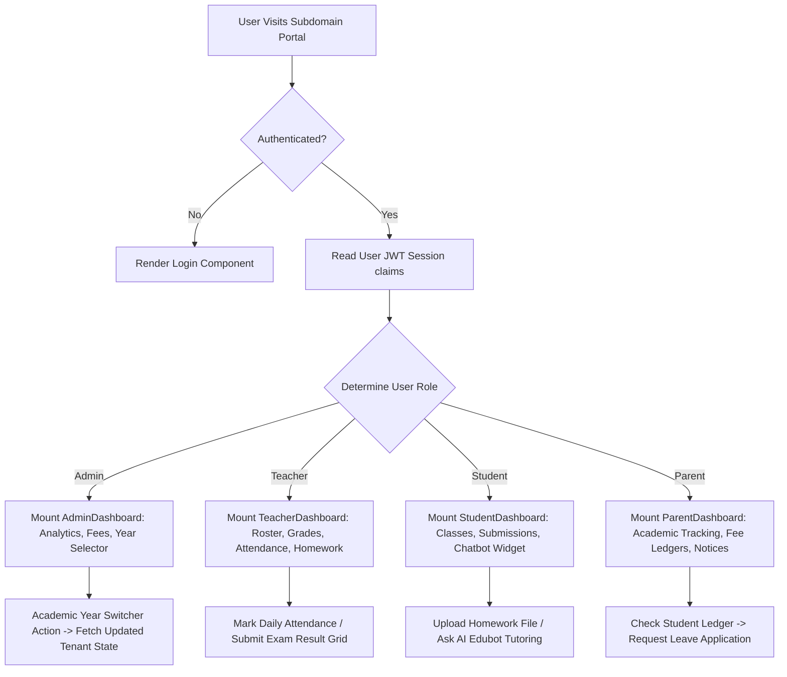
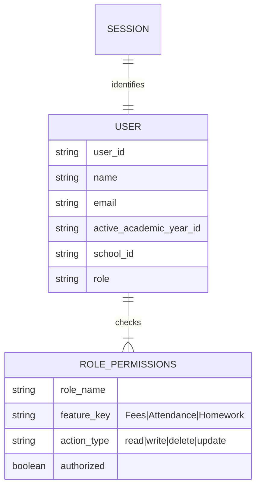

# User Story: Eduplexo Frontend ERP (`school-react-app`)

## 1. Goal
Provide a premium, lightning-fast, and responsive multi-role ERP interface (`school-react-app`) using React 19 + Vite 6 + TypeScript. The application acts as a single-page application (SPA) serving School Admins, Teachers, Students, and Parents with proper role-based access control (RBAC), tenant isolation, and a built-in AI educational assistant.

---

## 2. Actors
* **School Admin**: Manages the school tenant resources (classes, academic years, fee structures, timetables, student/teacher rosters).
* **Teacher**: Manages class attendance, uploads homework, enters exam grades, and reviews leave applications.
* **Student**: Accesses active academic year schedules, checks fee ledger status, uploads homework, joins live classes, and chats with the AI study assistant.
* **Parent**: Tracks student performance, behavior logs, attendance calendars, daily fee status, and triggers online payments.
* **Super Admin**: Platform-level controller with access to global billing, system performance diagnostics, and tenant onboarding verification.

---

## 3. User Stories & Acceptance Criteria

### Story 1: Role-Based Dashboard and Active Academic Year Selector
**As an** Authenticated School User (Admin, Teacher, Student, Parent)  
**I want to** log in, see a personalized dashboard reflecting my specific role permission privileges, and switch between academic years  
**So that** I can view and manage relevant records contextually without cross-tenant or out-of-bounds exposure.

#### Acceptance Criteria:
* **AC 1.1**: The main navigation sidebar dynamically hides/shows items based on the user's RBAC matrix defined in the session JWT.
* **AC 1.2**: Admins see a persistent academic year dropdown to switch session context (e.g., switching from 2025-2026 to 2026-2027) which immediately re-fetches corresponding dashboard analytics.
* **AC 1.3**: The UI enforces complete theme and color customization based on tenant settings returned by the Go backend (e.g., logo, main primary color, custom name).

### Story 2: Fee Ledger Visibility & Adjustments Management
**As an** Admin or Parent  
**I want to** access a comprehensive billing/fee ledger with adjustive transaction options  
**So that** Parents can review outstanding fees and Admins can apply active discounts or penalties.

#### Acceptance Criteria:
* **AC 2.1**: Parents see a chronologically sorted monthly ledger with clear indicators for Paid, Pending, and Overdue balances.
* **AC 2.2**: Admins see an adjustments panel on student fee ledgers to add penalties or active discount adjustments applying at `due_at`.
* **AC 2.3**: Triggers online payments directly from the ledger dashboard, instantly updating the frontend state using SSE (Server-Sent Events) or REST polling.

---

## 4. Mermaid Diagrams

### A. Mermaid Flowchart: Role-Based Routing & Navigation



### B. Mermaid Sequence Diagram: Switch Academic Year Transaction

```mermaid
sequence diagram
    actor Admin as School Administrator
    participant UI as React UI (school-react-app)
    participant API as Go Backend API (backend-go)
    participant DB as PostgreSQL Database

    Admin->>UI: Selects new Academic Year (e.g., "2026-2027") from selector
    UI->>API: POST /api/academic-years/switch { "academic_year_id": "ay_2026" }
    Note over API: Verify Admin Permission & School tenant
    API->>DB: Validate academic_year_id under tenant_id
    API-->>UI: Re-issues Session JWT containing updated active_academic_year_id
    Note over UI: Flush previous cache state
    UI->>API: GET /api/analytics/dashboard (with updated JWT header)
    API->>DB: Query analytics filtered by new active_academic_year_id
    API-->>UI: { "active_students": 250, "fees_collected": 15000, ... }
    UI-->>Admin: Dynamic dashboard dashboard transition complete!
```

### C. Mermaid ER Diagram: Client-Side State Schema



### D. Mermaid Use Case Diagram: Role-Specific Action Triggers

```mermaid
usecase3 "Use Case Diagram - Frontend ERP"
left to right direction
actor "Admin" as Admin
actor "Teacher" as Teacher
actor "Student" as Student
actor "Parent" as Parent

rectangle "Eduplexo ERP Portal (school-react-app)" {
    usecase "Switch Academic Year Context" as UC1
    usecase "Configure Fee Invoice Allocation" as UC2
    usecase "Track Daily Student Attendance" as UC3
    usecase "Review Leave Applications" as UC4
    usecase "Submit Course Homework File" as UC5
    usecase "Initiate Fee Payment Gateway" as UC6
    usecase "Query AI Tutor Assistance" as UC7
}

Admin --> UC1
Admin --> UC2
Admin --> UC4

Teacher --> UC3
Teacher --> UC4

Student --> UC5
Student --> UC7

Parent --> UC6
Parent --> UC7
```

---

## 5. Technical Constraints & Bounds
* **State Management**: Zero global state boilerplate. Use React Context or lightweight Zustand stores to persist session data, localizing page-level mutations cleanly.
* **Component Architecture**: Built using a premium custom HSL color palette. Absolutely no ad-hoc inline styles. Use responsive flex/grid layouts with native CSS styling.
* **API Parity**: MSW is disabled in production. Every request is proxied through Nginx to the internal `backend-go` server on port 8080.
