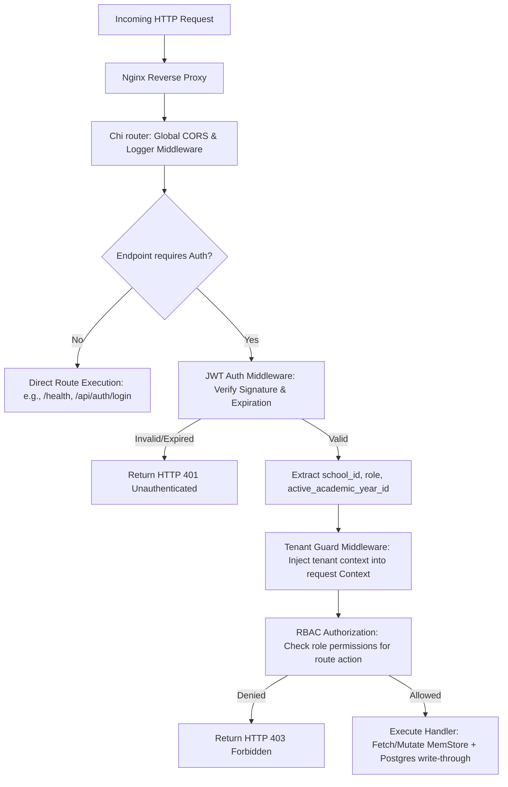
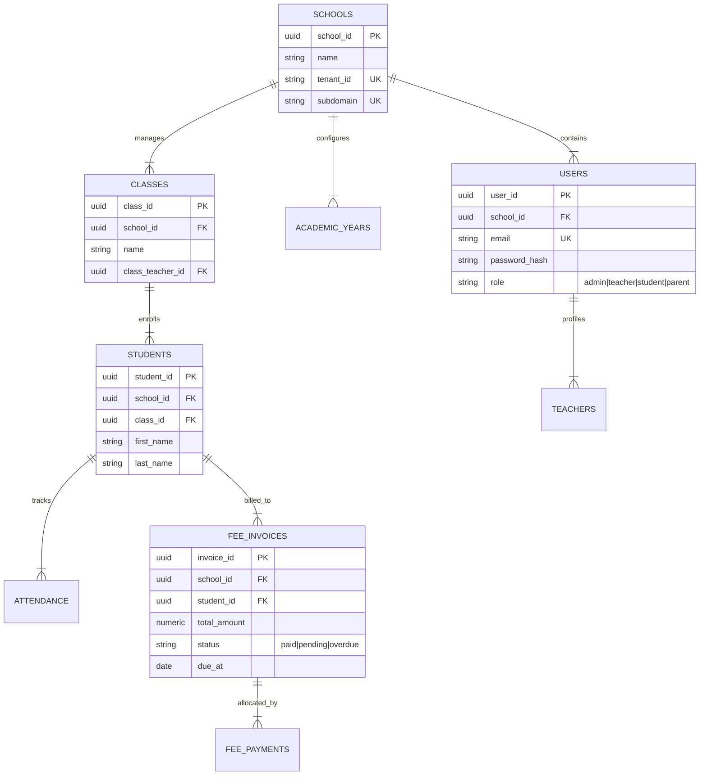

# User Story: Eduplexo Go Backend API (`backend-go`)

## 1. Goal
Implement a high-concurrency, ultra-fast Go API server (`backend-go`) using Chi, pgx PostgreSQL pool, and a hybrid memory caching strategy (MemStore with periodic snapshotting write-through to PostgreSQL). The backend must serve as the single source of truth, enforcing strict multi-tenant schema isolation, cryptographic JWT authorization, robust role-based access control (RBAC), and reliable relational persistence.

---

## 2. Actors
* **React ERP Frontend (school-react-app)**: Interacts with API endpoints using authenticated user session tokens.
* **Database Migration Runner**: Automatically applies relational SQL migrations at bootstrap.
* **Internal Cron Scheduler**: Manages periodic database snapshot routines and automatic invoice generation.

---

## 3. User Stories & Acceptance Criteria

### Story 1: Strict Multi-Tenant Separation & JWT Verification Middleware
**As a** Security Auditor  
**I want** every HTTP request entering the API to be intercepted by a tenant-isolation and cryptographic JWT-verification middleware  
**So that** users are strictly bounded to their school scope, preventing cross-tenant data leaks and unauthorized data mutation.

#### Acceptance Criteria:
* **AC 1.1**: The authorization middleware extracts the JWT from the `Authorization` header, decrypts it using the local `JWT_SECRET`, and rejects invalid tokens with an `HTTP 401 Unauthenticated` status.
* **AC 1.2**: The tenant isolation guard extracts the `school_id` and `active_academic_year_id` from the JWT claims, injection-protecting all downstream relational queries by filtering strictly against these IDs.
* **AC 1.3**: Requests without valid tenant/school bindings are immediately aborted, returning an `HTTP 403 Forbidden` response with detailed security audit logging.

### Story 2: High-Performance Caching & Transactional Write-Through
**As a** Platform Administrator  
**I want** mutations to write to a thread-safe, in-memory cache (MemStore) with a background flush write-through to PostgreSQL  
**So that** read speeds are virtually instantaneous while guaranteeing complete durability during system restarts.

#### Acceptance Criteria:
* **AC 2.1**: Write operations (such as recording a student fee payment or attendance) update the thread-safe `MemStore` cache instantly, returning success to the user within < 10ms.
* **AC 2.2**: The write-through engine registers mutating actions, executing database writes to the PostgreSQL pool sequentially every 1 second.
* **AC 2.3**: A background scheduler performs a full snapshot (`FullSnapshot`) backup every 30 seconds and on graceful shutdown, restoring the exact system state from Postgres during service cold boots.

---

## 4. Mermaid Diagrams

### A. Mermaid Flowchart: Request Lifecycle & Middleware Stack



### B. Mermaid Sequence Diagram: Write-Through Persistence Strategy

```mermaid
sequence diagram
    participant UI as React ERP Client
    participant API as Go Backend API
    participant Cache as MemStore (Thread-Safe Cache)
    participant DB as PostgreSQL Database

    UI->>API: POST /api/fees/payments (Record payment details)
    Note over API: Inside Tenant Context
    API->>Cache: Lock & Update In-Memory cache (O(1) update)
    Cache-->>API: Success
    API-->>UI: HTTP 200 OK (Payment Recorded)
    
    par Background Persistence (1-second flush interval)
        Note over API: Flush worker triggers
        API->>DB: Start DB Transaction
        API->>DB: INSERT INTO fee_payments / allocations (FIFO allocation)
        API->>DB: Commit Transaction
        DB-->>API: Persisted Successfully
    end

    par Background Full Snapshot (30-second interval)
        Note over API: Snapshot scheduler triggers
        API->>DB: INSERT INTO audit_logs (snapshot metadata)
        DB-->>API: Done
    end
```

### C. Mermaid ER Diagram: Relational Core Schema (38 Tables Representation)



### D. Mermaid Use Case Diagram: Backend Services Orchestration

```mermaid
usecase3 "Use Case Diagram - Backend Engine"
left to right direction
actor "React Client" as Client
actor "Cron Engine" as Cron
actor "DB Migrator" as Migrator

rectangle "Go Backend API (backend-go)" {
    usecase "Validate JWT Token & RBAC Claims" as UC1
    usecase "Perform Tenant-Isolated SQL Execution" as UC2
    usecase "Hydrate MemStore Cache at Cold Boot" as UC3
    usecase "Flush In-Memory Writes to Postgres (1s)" as UC4
    usecase "Commit Full System Snapshots (30s)" as UC5
    usecase "Automate Monthly Invoice Generation" as UC6
}

Client --> UC1
Client --> UC2
Client --> UC4

Cron --> UC4
Cron --> UC5
Cron --> UC6

Migrator --> UC3
```

---

## 5. Technical Constraints & Bounds
* **Concurrency**: Use Go channels and sync mutex libraries to guarantee that parallel write access to `MemStore` cache does not trigger memory races.
* **SQL Best Practices**: All raw PostgreSQL queries must be run via prepared statement parameters to prevent SQL injection vulnerabilities.
* **Zero Alter Migrations**: Maintain zero-alter database schema design, verifying that all database updates are modularly scoped.
