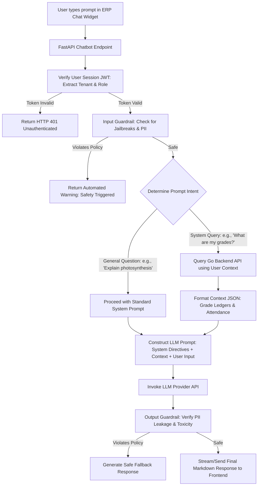
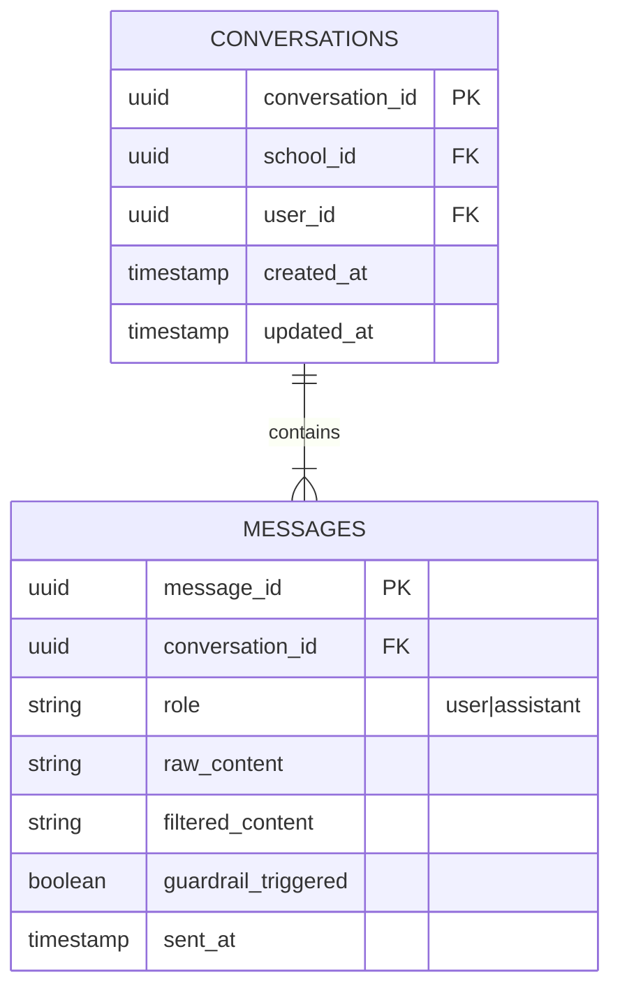

# User Story: Eduplexo AI Chatbot (`edubot-service`)

## 1. Goal
Provide a context-aware, secure, and responsive AI Chatbot Service (`edubot-service`) powered by Python, FastAPI, and an LLM framework with strict security guardrails. The chatbot must act as a personalized AI Tutor for students, a performance counselor for parents, and an administrative assistant for teachers, integrating securely with backend API data while preventing cross-tenant information leaks.

---

## 2. Actors
* **Student User**: Interacts with the AI Chatbot to ask study-related questions, get step-by-step tutoring assistance, and check their personalized class timetable.
* **Parent User**: Interacts with the AI Chatbot to query their child's attendance details, recent exam results, and upcoming fee dues.
* **Teacher User**: Interacts with the AI Chatbot to draft course lesson plans, generate quiz questions, and analyze overall class performance.
* **Security Guardrail Engine**: Evaluates every user prompt and AI response to enforce privacy policies, block prompt injection attacks, and filter unauthorized data.

---

## 3. User Stories & Acceptance Criteria

### Story 1: Context-Aware Safe Tutoring & Performance Q&A
**As an** Authenticated Student or Parent  
**I want to** type natural language questions in the chatbot panel and receive highly personalized responses derived securely from my student record profile  
**So that** I can instantly understand grades or clarify complex topics without navigating multi-level dashboards.

#### Acceptance Criteria:
* **AC 1.1**: The chatbot parses the user's role and tenant school bindings from their session JWT before executing the prompt context extraction.
* **AC 1.2**: For parents, the chatbot queries the backend-go API using authenticated REST calls to fetch student attendance and exam data, merging it with the prompt context.
* **AC 1.3**: The AI must refuse to answer questions about any student, class, or school records outside the caller's authorized tenant scope (returning a neutral safety override message).

### Story 2: Prompt Guardrail and LLM Security Controls
**As a** Platform Security Officer  
**I want** all system inputs and LLM outputs to pass through automated validation guardrails  
**So that** prompt injections are blocked, sensitive system architecture details are never leaked, and responses are educational and age-appropriate.

#### Acceptance Criteria:
* **AC 2.1**: The guardrail engine inspects the incoming prompt for common jailbreak/injection patterns, rejecting invalid prompts with an `HTTP 400 Bad Request` or an automated warning message.
* **AC 2.2**: System prompt templates restrict the LLM to act strictly as an educational assistant, preventing it from executing external code or expressing opinions outside school-related topics.
* **AC 2.3**: Every generated output is audited for PII (Personally Identifiable Information) exposure before rendering in the frontend chat widget.

---

## 4. Mermaid Diagrams

### A. Mermaid Flowchart: Secure Chatbot Request Processing Pipeline



### B. Mermaid Sequence Diagram: Parent Querying Grade Records

```mermaid
sequence diagram
    actor Parent as School Parent
    participant UI as React Chat Widget (Vite)
    participant Bot as AI Chatbot (edubot-service)
    participant API as Go Backend API (backend-go)
    participant LLM as LLM Orchestration Engine

    Parent->>UI: Type: "How did my son do in the recent Math exam?"
    UI->>Bot: POST /api/chat/query (Prompt + JWT)
    Note over Bot: Validate Parent JWT & Tenant school_id
    
    Bot->>API: GET /api/students/{id}/results (using internal service token)
    API-->>Bot: JSON: { "student": "Ali", "exam": "Math Midterm", "score": 92, "grade": "A" }
    
    Note over Bot: Construct Context-Enhanced Prompt
    Bot->>LLM: Invoke LLM with Context: "Student Ali got 92 (A) in Math Midterm..."
    LLM-->>Bot: "Your son, Ali, performed exceptionally well, scoring 92% (Grade A)..."
    
    Note over Bot: Run Output Guardrail checks
    Bot-->>UI: Deliver detailed Markdown Response
    UI-->>Parent: Render message: "Ali scored 92% (A) in Math Midterm..."
```

### C. Mermaid ER Diagram: Conversational Audit Schema



### D. Mermaid Use Case Diagram: Chatbot Scenarios

```mermaid
usecase3 "Use Case Diagram - Chatbot Service"
left to right direction
actor Student
actor Parent
actor Teacher
actor "Guardrail Engine" as Guardrail

rectangle "AI Chatbot Service (edubot-service)" {
    usecase "Answer Homework Questions" as UC1
    usecase "Generate Custom Study Plans" as UC2
    usecase "Fetch Student Grade Summary" as UC3
    usecase "Query Daily Attendance Logs" as UC4
    usecase "Draft Course Lesson Outline" as UC5
    usecase "Audit Prompt Compliance" as UC6
}

Student --> UC1
Student --> UC2

Parent --> UC3
Parent --> UC4

Teacher --> UC5

Guardrail --> UC6
```

---

## 5. Technical Constraints & Bounds
* **Data Privacy**: The chatbot must never store raw LLM API keys locally. Use environment variable key injection on load.
* **Latency**: Stream text output using Server-Sent Events (SSE) or WebSockets to keep perceived system latency < 500ms.
* **Guardrail Reliability**: Maintain strict regular expression and semantic checks to guarantee a near-zero leak rate of platform administrative credentials.
