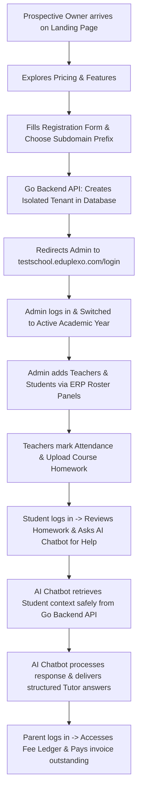
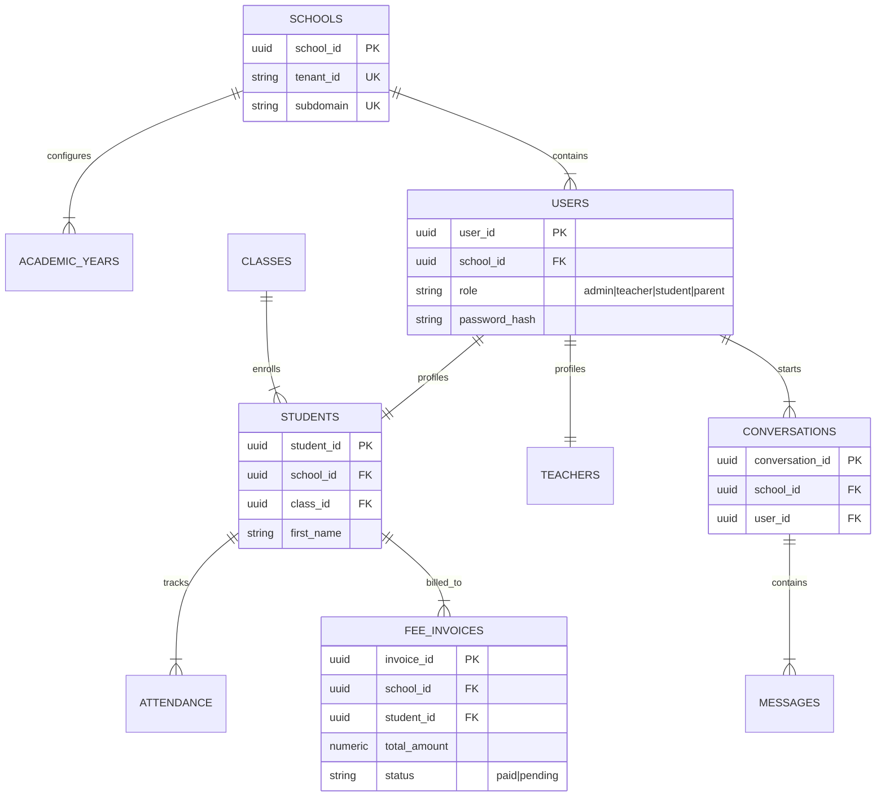

# User Story: Eduplexo Integrated SaaS Platform (All-in-One System)

## 1. Goal
Orchestrate a fully integrated, multi-tenant school management SaaS ecosystem combining the landing page (`landing-app`), the modern Vite React ERP portal (`school-react-app`), the high-performance Go API core (`backend-go`), and the Python-based AI assistant (`edubot-service`). The integrated platform must support a seamless lifecycle starting from tenant onboarding to active daily school administrative and tutoring operations under secure tenant separation.

---

## 2. Actors
* **Prospective School Owner (becomes Tenant Primary Admin)**: Discovers the platform on the landing page, registers their school, and configures the system.
* **School Teachers**: Manages daily classroom attendance, grading, homework submissions, and lesson planning.
* **Students**: Joins live courses, submits homework, reviews timetables, and uses the AI chatbot as an interactive tutor.
* **Parents**: Reviews monthly fee ledger balances, makes online payments, checks child attendance logs, and asks the AI chatbot about student performance.
* **System Cron Workers**: Performs automatic snapshot persisting (every 30s) and generates monthly fee invoices.

---

## 3. User Stories & Acceptance Criteria

### Story 1: Global SaaS Onboarding and ERP Bootstrapping Flow
**As a** Prospective School Owner  
**I want to** read about the platform, register my school subdomain, log into my custom ERP portal, and populate my initial administrative configurations  
**So that** my school can immediately start running operations on a fully isolated multi-tenant system.

#### Acceptance Criteria:
* **AC 1.1**: The Landing Page registration submits details to the Go API backend, creating a fresh PostgreSQL record with a custom subdomain prefix (e.g., `testschool`).
* **AC 1.2**: The Go API initializes a transactional baseline, seeding default roles, system permissions, and initial academic years under the new tenant ID context.
* **AC 1.3**: The Owner is redirected to their newly active tenant subdomain ERP URL (`testschool.eduplexo.com/login`) where they authenticate using their primary administrator credentials.

### Story 2: Integrated AI Tutoring & Grade Tracking Flow
**As a** Student or Parent  
**I want to** log into the ERP dashboard, review outstanding homework assignments or fee invoices, and engage the AI Chatbot to receive real-time answers based on student data  
**So that** I have a single, unified experience where administrative metrics and AI guidance are combined.

#### Acceptance Criteria:
* **AC 2.1**: The Vite React frontend loads the chatbot widget, sending the authenticated session JWT in every API call to the `edubot-service`.
* **AC 2.2**: The `edubot-service` performs verification of the user context, querying the `backend-go` server securely for grades and attendance records before passing safe context to the LLM.
* **AC 2.3**: The response streams back to the React UI as clean markdown, ensuring the student only sees their own data, and the parent only sees their own child's records.

---

## 4. Mermaid Diagrams

### A. Mermaid Flowchart: Global End-to-End Onboarding & Lifecycle Journey



### B. Mermaid Sequence Diagram: Integrated Platform Communication Architecture

```mermaid
sequence diagram
    actor Owner as School Owner / Parent
    participant Land as Landing Page (landing-app)
    participant UI as Vite ERP (school-react-app)
    participant Bot as AI Chatbot (edubot-service)
    participant API as Go Backend API (backend-go)
    participant DB as PostgreSQL Database

    Note over Owner, DB: Phase 1: Onboarding
    Owner->>Land: Click Sign Up & Submit school details
    Land->>API: POST /api/tenants/register { subdomain: "testschool" }
    API->>DB: INSERT INTO schools & seed default tables
    API-->>Land: HTTP 201 Created { redirect_url: "testschool.eduplexo.com" }
    Land-->>Owner: Redirect to Subdomain Portal...

    Note over Owner, DB: Phase 2: Active ERP Operations
    Owner->>UI: Log in as Parent & Access Chatbot widget
    UI->>API: POST /api/auth/login -> Receive Session JWT
    Owner->>UI: Type: "What is my child's attendance rate?"
    UI->>Bot: POST /api/chat/query { prompt, token: JWT }
    
    Note over Bot: Verify parent authorization & school context
    Bot->>API: GET /api/students/{id}/attendance (with internal service token)
    API->>DB: SELECT attendance WHERE student_id = ?
    DB-->>API: Returns attendance data
    API-->>Bot: JSON: { "present_days": 18, "total_days": 20 }
    
    Note over Bot: Inject data context into LLM Prompt
    Bot->>Bot: LLM generates structured answer with 90% attendance rate
    Bot-->>UI: Streams structured Markdown response
    UI-->>Owner: Displays: "Your child's attendance rate is 90%..."
```

### C. Mermaid ER Diagram: Unified Global Data Model



### D. Mermaid Use Case Diagram: Global SaaS Access Matrix

```mermaid
usecase3 "Use Case Diagram - Global SaaS Matrix"
left to right direction
actor "School Owner" as Owner
actor Student
actor Parent
actor Teacher

rectangle "Eduplexo Integrated SaaS Platform" {
    usecase "Register School Tenant (Landing)" as UC1
    usecase "Switch Academic Year Context (ERP)" as UC2
    usecase "Manage Tuition Fees & Ledgers (ERP)" as UC3
    usecase "Mark Daily Course Attendance (ERP)" as UC4
    usecase "Verify Grades & Timetables (ERP)" as UC5
    usecase "Submit Course Homework File (ERP)" as UC6
    usecase "Query Secure AI Tutor Chatbot (Edubot)" as UC7
}

Owner --> UC1
Owner --> UC2
Owner --> UC3

Teacher --> UC4

Student --> UC5
Student --> UC6
Student --> UC7

Parent --> UC3
Parent --> UC5
Parent --> UC7
```

---

## 5. System Interconnectivity & Bounds
* **Core Communications**: The ERP Client uses standard HTTP/HTTPS protocol headers containing the active JWT for backend and chatbot API access. Internal inter-service routing is handled directly using container networking on Docker ports `8080` (Go Backend) and `5000` (Chatbot).
* **Data Security & Tenant Isolation**: Global isolation is strictly enforced at the database level by filtering every SQL query using the token's authenticated `school_id`. Cross-tenant querying is cryptographically impossible.
* **Write-Through Synchronization**: All UI actions are backed up instantly into local `MemStore` cache threads, syncing to relational PostgreSQL tables within a strict 1-second timeout loop.
